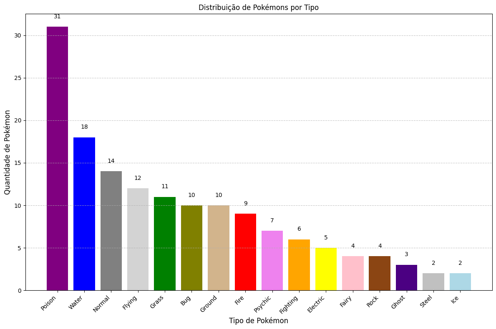

# Pokémon Data Analysis

## Descrição
Este projeto realiza a extração, transformação e análise de dados de Pokémon utilizando a [PokeAPI](https://pokeapi.co/). Ele é estruturado como um pipeline, com etapas para extrair dados, transformá-los e gerar relatórios e gráficos. Além disso, o projeto está configurado para ser executado tanto localmente quanto em um contêiner Docker.

## Visão Geral
- **Linguagem:** Python 3.13.1
- **Bibliotecas:** `pandas`, `matplotlib`, `requests`, `logging`
- **Execução:** Local ou via Docker
- **Saídas:** Relatórios em CSV e gráficos em PNG

## Estrutura do Projeto
```plaintext
poke-data-analysis/
├── reports/              # Relatórios e gráficos gerados
├── src/                  # Código-fonte do projeto
│   ├── extraction.py     # Extração de dados da PokeAPI
│   ├── transformation.py # Transformação e análise de dados
│   ├── report.py         # Geração de relatórios e gráficos
│   ├── pipeline.py       # Execução do pipeline completo
│   └── utils.py          # Funções auxiliares, como mapeamento de cores dos tipos de Pokémon
├── Dockerfile            # Arquivo Dockerfile para contêiner Docker
├── requirements.txt      # Dependências do projeto
└── README.md             # Este arquivo

```

## Instrução de instalação
### 1. Instalando dependências no ambiente local
Certifique-se de ter o Python 3.13 ou superior instalado. Você pode verificar sua versão do Python com o comando:
```bash
python --version
```
Para instalar as dependências localmente, siga os seguintes passos:
  1. Clone o repositório para sua máquina local:
     ```bash
     git clone https://github.com/seu-usuario/poke-data-analysis.git
     cd poke-data-analysis
     ```
  2. instale as dependências com o pip:
     ```bash
     pip install -r requirements.txt
     ```

### 2. Executando o pipeline localmente
Após a instalação das dependências, você pode executar o pipeline localmente. O comando a seguir irá executar o script `pipeline.py`, que realiza a extração dos dados, transformação e geração do relatório:
```bash
python src/pipeline.py
```

### 3. Executando o pipeline com Docker
Se preferir rodar o projeto dentro de um contêiner Docker, siga as instruções abaixo.  
#### 3.1. Construindo a imagem Docker  
Com o Docker instalado, você pode construir a imagem Docker do projeto com o seguinte comando (certifique-se de estar na raiz do projeto, onde o `Dockerfile` está localizado):
```bash
docker build -t pokemon-pipeline .
```
#### 3.2. Executando o contêiner Docker
```bash
docker run pokemon-pipeline
```

## Saídas geradas
Os relatórios gerados estarão disponíveis na pasta `reports` no diretório local onde o comando foi executado:
```plaintext
reports/
├── stats_by_type.csv         # Estatísticas por tipo de Pokémon
├── top_5_experience.csv      # Top 5 Pokémon com maior experiência base
└── types_distribution.png    # Gráfico de distribuição de Pokémon por tipo
```

### Exemplos:
1. **Relatório de Estatísticas por Tipo** (`stats_by_type.csv`):
   | Tipo    | Ataque Médio | Defesa Média | HP Médio |
   |---------|--------------|--------------|----------|
   | Water   | 72.33        | 62.89        | 72.50    |
   | Fire    | 80.12        | 55.80        | 58.40    |
   | Grass   | 65.00        | 63.33        | 68.00    |

2. **Top 5 Pokémon por Experiência Base** (`top_5_experience.csv`):
   | Nome         | Experiência Base |
   |--------------|------------------|
   | Dragonite    | 270              |
   | Charizard    | 240              |
   | Blastoise    | 239              |
   | Venusaur     | 236              |
   | Pikachu      | 211              |

3. **Gráfico de Distribuição de Pokémon por Tipo** (`types_distribution.png`):  
   O gráfico de barras é gerado utilizando cores personalizadas para cada tipo de Pokémon (ex.: `Water` = azul, `Fire` = vermelho, etc.), tornando as visualizações mais claras e informativas.
   
   

## Gerenciamento de Logs
### 1. Localmente
Os logs da execução do pipeline são gravados no arquivo `pipeline.log` na raiz do projeto.
### 2. Docker
Para acessar os logs do pipeline rodando no Docker, use o comando:
```bash
docker logs -f <container_id>
```

## Créditos
Este projeto utiliza dados da [PokeAPI](https://pokeapi.co/) e foi desenvolvido como um exemplo de pipeline de dados.
